# 自动助手🚀️

掘金自动签到、抽奖、游戏挖矿石，有道笔记自动签到获取空间(暂时去除)。签到抽奖结果发送到微信。

微信消息推送原本想使用公众号，但是公众号推送消息需要企业认证。最后使用了企业微信自定义机器人的方式进行消息推送(企业微信可配置微信接收消息，具体自己百度)。

## 效果

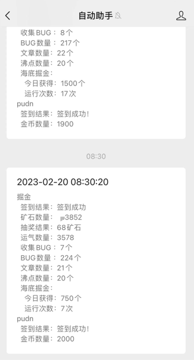

## 需要用到的

1. 企业微信
2. 共有IP(云服务器自带)

## 部署
1. 将docker/docker-compose.yml 放到要部署的服务器上
2. 修改docker-compose.yml中的环境变量
3. docker-compose up -d

掘金cookie必须配置，微信和钉钉的根据需要自己配置。

目前只使用了微信发送消息，钉钉发送消息需修改源代码，目前没有做配置项(后续会增加该配置)。

## 配置获取

### 掘金cookie获取方法，浏览器掘金登陆后抓任意一个url找到下图请求头中的值即可

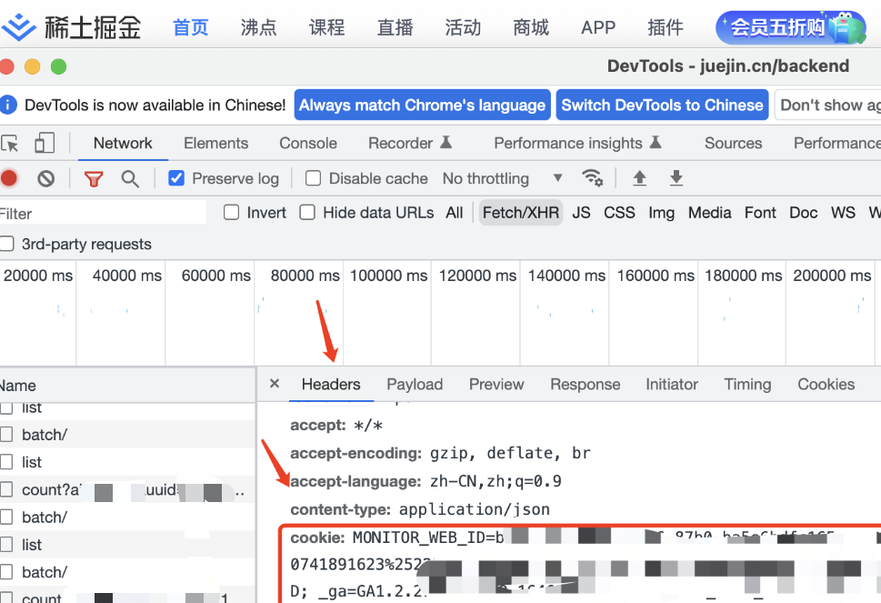

### 有道笔记获取cookie和上方掘金相同不再介绍

### 企业微信获取企业ID、应用ID和Secret

1. 登陆企业微信自己创建一个
2. 登陆[企业微信管理平台](https://work.weixin.qq.com/wework_admin/frame#index)
3. 我的企业 --> 获取企业ID
4. 应用管理 --> 创建应用 --> 获取应用的ID和Secret  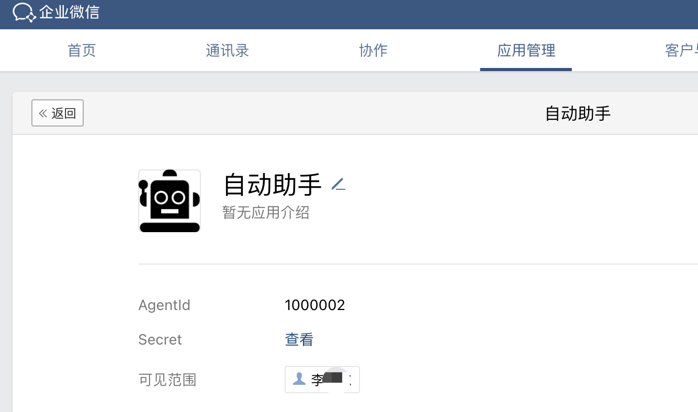
5. 第4步中最下面 --> 企业可信IP, 将自己服务器的IP配置进去，不然无法退送消息

# ChatGPT
1. 账号登陆[获取gpt的key](https://platform.openai.com/account/api-keys)
2. 创建key 然后将这个key写入docker-compose  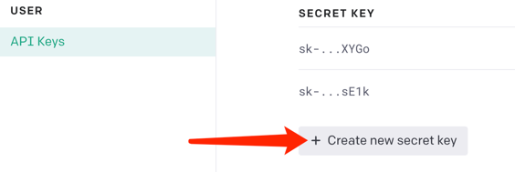

# ChartGPT(基于Web页面)
> 使用[大佬的web页面](https://megumi.ml)，调用页面中的接口，重新解析然后发送到钉钉或者微信  
> [web页面开源代码](https://github.com/Chanzhaoyu/chatgpt-web)
1. 使用大佬的web页面登陆，随便问一个问题然后将下图中的ID写入配置文件 megumiParentMessageId中，此步骤可以忽略。
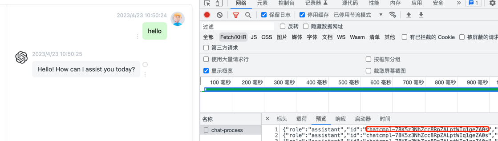

# ChatGPT(微信)

## 效果 

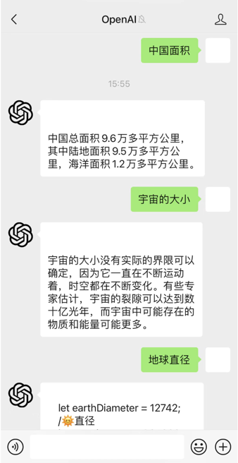

## 需要用到的

1. 企业微信
2. ChatGPT的key

## 创建机器人和上方步骤一样

1. 将AgentId和Secret写入docker-compose
2. 服务器开放8888端口
3. 应用管理 --> 刚创建的应用 --> 设置API接收 
4. url配置 http://IP:8888/weixin 将token和key写入docker-compose   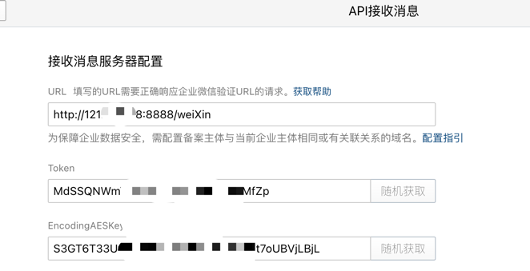

# ChatGPT(钉钉)

## 效果

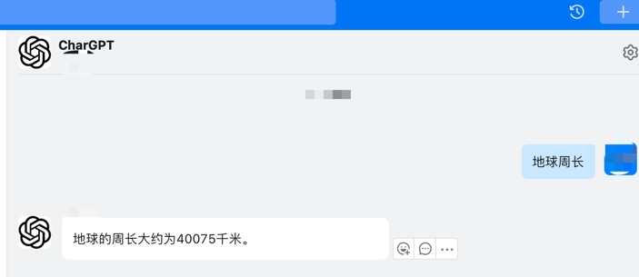

## 需要用到的

1. 钉钉
2. ChatGPT的key

## 创建钉钉机器人
1. 登陆[钉钉开发平台](https://open-dev.dingtalk.com/?spm=dd_developers.homepage.0.0.205a4a97lQMxqS#/)
2. 应用开发 --> 企业内部开发 --> 创建应用   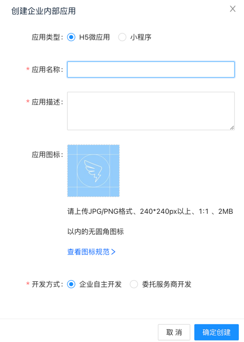
3. 获取应用的信息，将两个配置写入 docker-compose中   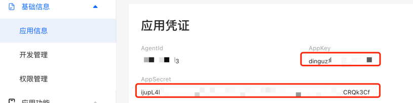
4. 设置消息退送地址，自己的服务器公网IP:8888/dingtalk  然后点击发布   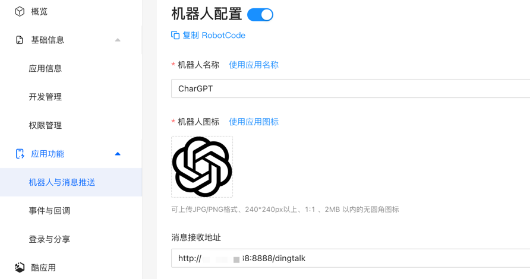

# 电信微信小程序云宠物

## 需要自己抓包
1. 抓取 https://api.k189.cn/app1/api 的body放到 telecom_getCodeBody
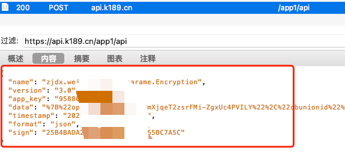
2. 抓取 https://hdmf.k189.cn/actServ/userJoin/getUserInfoByCode 的body中的aid放到 telecom_aid 如下图
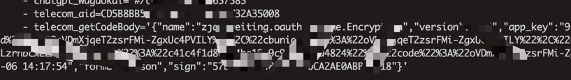