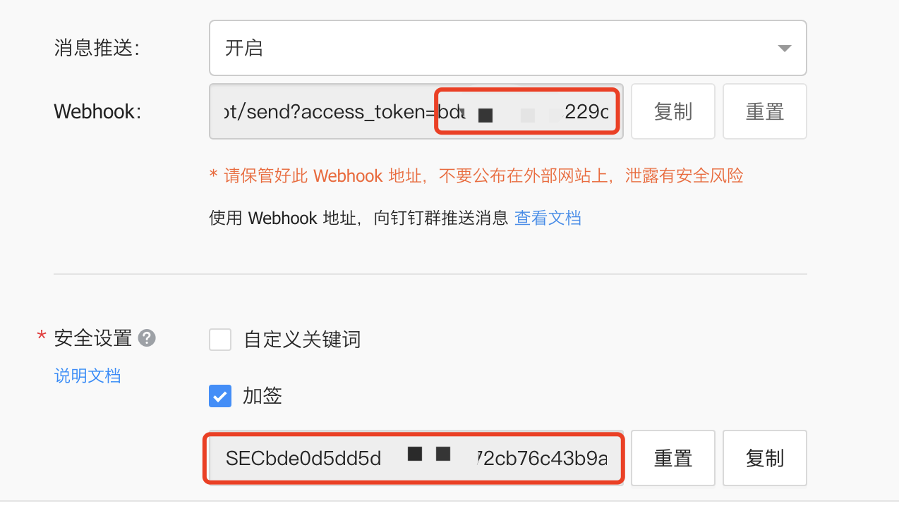

# 自动助手🚀️

掘金自动签到、抽奖。签到抽奖结果发送到微信。

微信消息推送原本想使用公众号，但是公众号推送消息需要企业认证。最后使用了企业微信自定义机器人的方式进行消息推送。

## 效果

## 部署

├── automatic
│   ├── automatic.jar
│   └── start.sh
├── docker-compose.yml
└── Dockerfile

需要docker-compose.yml修改其中的环境变量，如不想使用环境变量可直接修改application.yml文件中的值。

掘金cookie必须配置，微信和钉钉的根据需要自己配置。

目前只使用了微信发送消息，钉钉发送消息需去juejinJob中修改。

## 配置获取

### 掘金cookie获取方法，浏览器掘金登陆后抓任意一个url找到下图请求头中的值即可

### 企业微信获取企业ID、应用ID和Secret

1. 登陆企业微信自己创建一个
2. 登陆[企业微信管理平台](https://work.weixin.qq.com/wework_admin/frame#index)
3. 我的企业 --> 获取企业ID
4. 应用管理 --> 创建应用 --> 获取应用的ID和Secret 

### 钉钉获取token和密钥

群管理 --> 智能群助手 --> 添加自定义Webhook机器人 --> 安全设置选择加密
